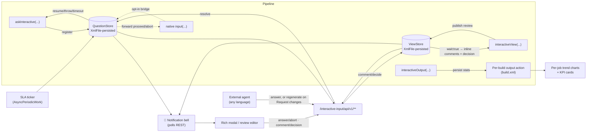
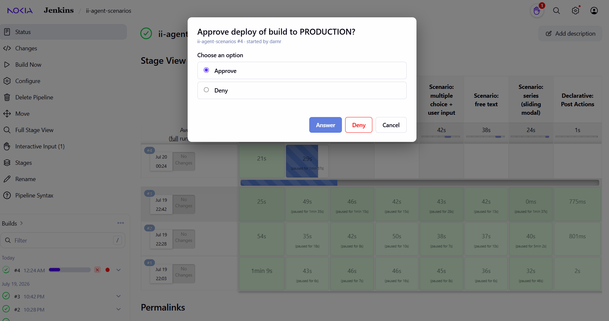
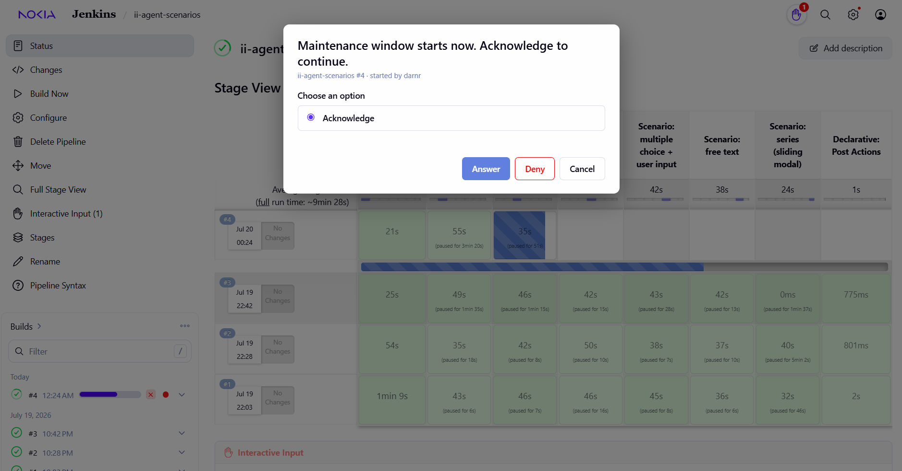
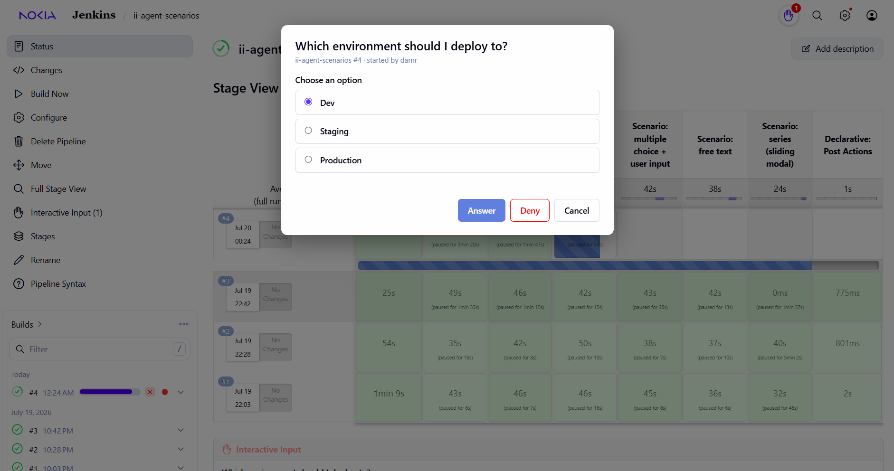
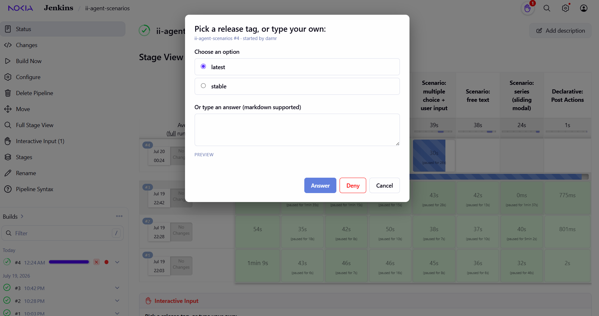
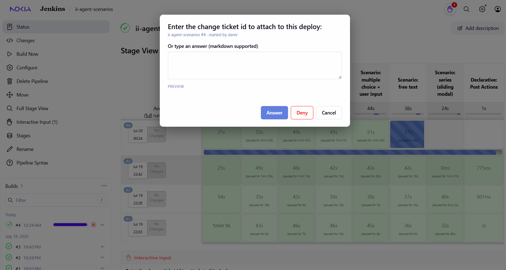
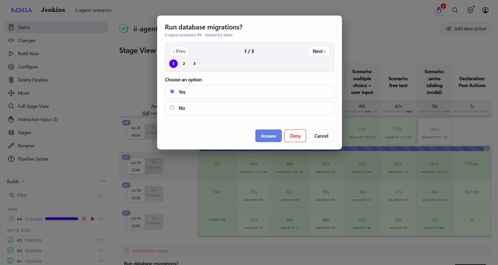
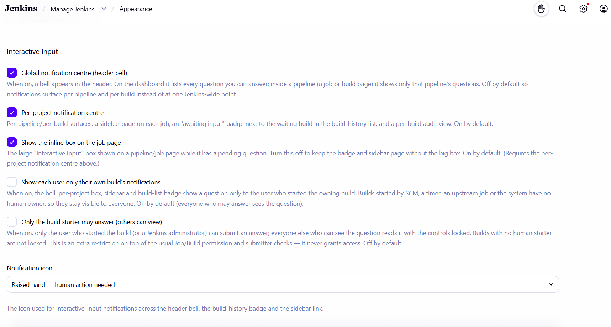
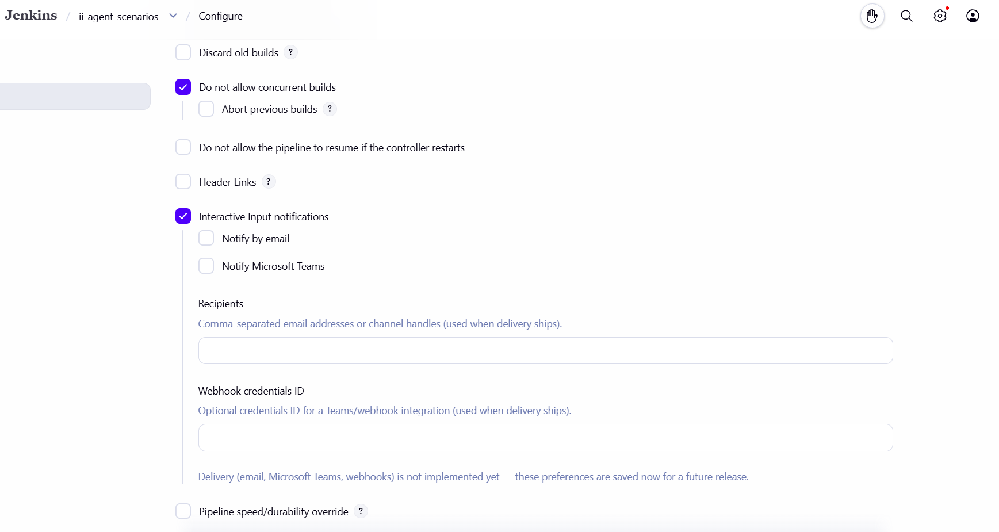

# Interactive CI

> A notification bell and a rich human‑in‑the‑loop (HITL) modal for Jenkins pipelines that pause for a human decision — plus a language‑agnostic REST API so any external agent (a bot, a script, an AI copilot) can answer on a human's behalf.

[](https://www.jenkins.io/)
[](https://adoptium.net/)
[](LICENSE)
[](https://www.jenkins.io/doc/book/pipeline/)
[](https://www.jenkins.io/projects/jcasc/)

---

## Table of contents

- [Why this plugin exists](#why-this-plugin-exists)
- [`input` vs `interactive-ci`](#input-vs-interactive-ci)
- [Features](#features)
- [How it works](#how-it-works)
- [Quick start](#quick-start)
- [The `askInteractive` step](#the-askinteractive-step)
- [The `interactiveView` step](#the-interactiveview-step)
- [The `interactiveOutput` step](#the-interactiveoutput-step)
- [Human-in-the-loop scenarios](#human-in-the-loop-scenarios)
- [Drive it from an AI agent (Python)](#drive-it-from-an-ai-agent-python)
- [REST API](#rest-api)
- [Bridging existing `input` steps](#bridging-existing-input-steps)
- [Settings and screens](#settings-and-screens)
- [Configuration (UI + JCasC)](#configuration-ui--jcasc)
- [Security model](#security-model)
- [Language applicability & restrictions](#language-applicability--restrictions)
- [Compatibility matrix](#compatibility-matrix)
- [Build from source](#build-from-source)
- [Project docs](#project-docs)
- [License](#license)

---

## Why this plugin exists

Jenkins has shipped a pipeline `input` step for years. It works, but it has three long‑standing gaps for teams doing serious human‑in‑the‑loop automation:

1. **There is no in‑UI signal that a build is waiting for you.** A paused build sits silently until someone happens to open the right build page. Approvers miss deploys; pipelines idle for hours against their will.
2. **The approval surface is minimal.** The built‑in prompt is a message, an OK button, and optional form parameters. There is no place for rich context (release notes, a diff, a risk summary), no notion of *why* each choice exists, and no first‑class way for an **external agent** to answer programmatically with a clean, versioned contract.
3. **There is nowhere to review a generated artifact or see a build's results in context.** When a pipeline — or an AI agent — produces a file (a design doc, a Terraform plan, release notes, a PR), there is no in‑Jenkins way to review it line by line, leave comments, and feed those comments back for regeneration; and per‑build metrics (cost, resource usage, carbon footprint) live only in the log, with no cards or trend across builds.

`interactive-ci` closes all three gaps **without changing anything about how your existing pipelines behave**. It adds a notification bell, a rich modal, a durable `askInteractive` step, a Confluence‑style file‑review surface (`interactiveView`) with a comment‑and‑regenerate loop, a per‑build statistics surface (`interactiveOutput`), and a REST API — all opt‑in, all governed by the same permission model Jenkins already enforces on `input`.

---

## `input` vs `interactive-ci`

Both pause a pipeline and wait for a human. Here is what changes:

| Capability | Built‑in `input` | `interactive-ci` |
|---|---|---|
| Pause a pipeline for a human decision | ✅ | ✅ (`askInteractive`) |
| **Per‑project notification centre** | ❌ | ✅ job‑page box + page, build‑history "awaiting input" badge, per‑build audit view |
| **In‑UI notification bell** | ❌ (silent until you open the build) | ✅ opt‑in global bell, header‑anchored, **context‑scoped** (dashboard = all answerable, inside a pipeline = that pipeline only), polled |
| **Shows who started the build** | ❌ | ✅ "started by &lt;user&gt;" on every surface |
| **Anchored console audit link** | ⚠️ links to the input form | ✅ links to a full audit view (what was shown + what was chosen) + "Paused" flow marker |
| **Rich modal** (context panel, per‑choice rationale) | ❌ message + OK only | ✅ Markdown context (expanded by default), choices with a "why", free‑text w/ live preview |
| **Structured choices with rationale** | ⚠️ via form parameters only | ✅ `[id, label, why]` first‑class |
| **Versioned JSON REST API** for external agents | ❌ (internal Stapler form POST) | ✅ `/interactive-input/api/v1/**` |
| **Answer from a script / bot / AI agent** | ⚠️ brittle (scrape crumb + form) | ✅ documented `POST …/answer` contract |
| **SLA / auto‑expiry** | ❌ waits forever (unless you code a `timeout{}`) | ✅ per‑step `slaMinutes` + global default |
| **Surfaces *existing* `input` steps** | n/a | ✅ opt‑in `inputStepBridge` (no pipeline edits) |
| **Safe Markdown rendering** | n/a | ✅ server‑side escaped (no raw HTML/script) |
| **JCasC configuration** | partial | ✅ every capability across `unclassified.interactiveInput` (functional) + `appearance.interactiveInputAppearance` (surfaces) |
| Durable across controller restart | ✅ | ✅ (same durable‑step foundation) |
| Permission model | Item.BUILD / submitter | ✅ **identical** (mirrors `pipeline-input-step`) |
| Runtime AI dependency | n/a | ❌ none — the API is generic HITL plumbing |

**TL;DR** — `interactive-ci` is a *superset UX and an integration surface* on top of the same durable, permission‑checked foundation as `input`. You can adopt it incrementally: flip on the bridge to light up existing inputs, or write new `askInteractive` steps when you want the richer surface.

---

## Features

- 📍 **Per‑project notification centre** — notifications surface *where the work is*, not at one Jenkins‑wide point: a box + sidebar page on each pipeline/job listing its pending questions, an "awaiting input" badge next to the relevant build in the build‑history list, and a per‑build audit view. On by default (`perProjectCentre`, under **Appearance**). The inline job‑page box has its **own** on/off switch (`jobPageBox`, on by default) so you can keep the badge + sidebar without the big box.
- 👁️ **Attention pulse** — the build‑history "awaiting input" badge and the job‑page box title **blink slowly in red** to catch the eye, with a `prefers-reduced-motion` fallback that disables the animation for motion‑sensitive users.
- 🎛️ **Choosable notification icon** — pick the icon used across the bell, badge and sidebar from seven meaning‑matched Ionicons (megaphone *(default)*, speech bubble, raised hand, pull‑request, hourglass, alert, classic bell) under **Appearance**.
- 👤 **Attribution** — every surface shows **who started the build** ("started by &lt;user&gt;", or `scm`/`timer`/`upstream`/`system`), so reviewers can tell whose job is waiting.
- 🔗 **Console audit link** — like the built‑in `input`, the build log gets an anchored link at the point of invocation; clicking it opens the audit view showing what was displayed and what was chosen. The flow node is also marked **Paused** so stage/flow views reflect the wait, and the outcome (answered/aborted/expired, by whom) is logged.
- 🔔 **Global notification bell** — an optional header badge with the count of questions *you* can answer, polled at a configurable cadence (no WebSocket/SSE, so it works through every corporate proxy). **Context‑scoped**: on the dashboard it lists **every** answerable question; inside a pipeline (a job/build page) it narrows to **that pipeline's** questions. **Off by default** (`notificationCentre`, under **Appearance**); anchored into the header controls (with a bottom‑right floating fallback) so it never overlaps the settings gear.
- 🪟 **Rich modal** — Markdown context panel (**expanded by default**), radio choices each with an optional rationale, optional free‑text with a live (server‑sanitised) preview, full keyboard/focus‑trap accessibility. Shared by the bell and every per‑project surface.
- 📨 **Per‑pipeline notification preferences** — a *Configure* section (email/Teams/recipients/webhook) that persists intent now; delivery ships in a future release.
- 🧩 **`askInteractive` step** — a durable pipeline step that returns the chosen id (or free text), throws on abort, and times out on SLA.
- 📝 **`interactiveView` step** — publish a generated file — or a **whole folder / glob of dynamically‑created files** (`includes`/`dir`, one review per match) — for a **Confluence‑style review** inside Jenkins: **per‑element inline comments** (click the exact heading, paragraph, list item or table row — on the source *or* the rendered Markdown — no line‑number dropdown) plus general comments, **threaded replies** (an automation can answer under a reviewer's comment with a configurable display name — default *AI response* — while the audit author stays the real identity), an editable review **copy** with version history (the original file is never touched; edits are allowed while a review is *open* **and** while *changes are requested*), and **approve / request changes / reject / acknowledge** (or a read‑only `mode: 'info'` viewer). Non‑blocking by default, or `wait: true` to pause the pipeline on the decision — which returns the reviewer's **inline comments** so a generator (e.g. an AI agent) can regenerate on *Request changes*. The per‑job page groups reviews by report/folder with **Needs‑approval vs Informational** sections and filters; content is snapshotted durably; **malformed GFM tables are repaired** before rendering; code/HTML is shown as **escaped, syntax‑highlighted source** (never executed) via `prism-api`.
- 📊 **`interactiveOutput` step** — publish per‑build statistics (cost, carbon footprint, resource usage, …) as **KPI cards + a filterable/sortable table** on the build page and a **per‑job chart** across builds via `echarts-api`, with a selectable `chartType` (**line / bar / pie / time‑series**) per report — time‑series plots date‑labelled metrics with a Time / Day / Month / Year granularity toggle.
- 🌐 **Versioned REST API** — `GET/POST` JSON under `/interactive-input/api/v1/`, permission‑checked, CSRF‑protected, with a stable envelope.
- 🌉 **`inputStepBridge`** — opt‑in reconciliation that mirrors *existing* native `input` steps into the bell/modal/API, forwarding answers back to the native step. Zero pipeline changes.
- ⏱️ **SLA + retention** — expire overdue questions; compact terminal ones after a retention window.
- ⚙️ **JCasC‑native** — configure everything as code; every capability is a feature flag.
- 🔒 **Secure by construction** — server‑side Markdown escaping, permission checks at every endpoint, no existence leaks, admin‑gated global list.

---

## How it works



A paused `askInteractive` step registers a `Question` in a durable, permission‑aware `QuestionStore`. The bell polls the REST API for questions the current user may answer; the modal (or any external agent) answers via `POST …/answer`; the store resolves the question and the pipeline resumes, throws (`abort`), or times out (SLA). Question metadata survives a controller restart via XStream; transient resolvers are re‑attached on step resume.

`interactiveView` publishes a durable `ReviewDocument` — an editable copy of the file (or one per file in a folder/glob) — to the `ViewStore`; reviewers add inline and general comments and a decision (approve / request changes / reject / acknowledge) through the same permission‑checked REST layer, and with `wait: true` the step returns the decision **and** the reviewer's inline comments so a generator (e.g. an AI agent) can regenerate on *Request changes*. `interactiveOutput` is non‑blocking: it persists per‑build statistics into the build itself and renders them as KPI cards + a filterable table on the build page and per‑job trend charts across builds.

### The pause → approve → resume flow

What a person actually experiences, end to end:

1. **Pause.** The build reaches `askInteractive(...)` (or a bridged native `input`) and suspends — *without* holding an executor. The stage shows **Paused** in the Pipeline Graph View, and the build **Console Output** gets an anchored *"Open interactive input"* link.
2. **Notice.** Everyone allowed to answer sees the pending question as soon as it appears — on the header bell, the job‑page box, the build‑history badge and the sidebar — kept fresh by polling, so no page reload is needed.
3. **Approve / answer.** A human opens the rich modal from any of those surfaces (or the console link) and **Approves**, **Denies**, picks a choice, or types an answer; an authorised agent can do the same via `POST …/answer`. Permissions are re‑checked server‑side on every answer.
4. **Resume.** On answer the build **continues from where it paused** with the returned value; **Deny** aborts the build (exactly like `input`); an unanswered question **auto‑expires** on its SLA. Either way the outcome (who answered and what they chose) is written to the console and the per‑build audit page.

A restart mid‑pause is safe: the question is persisted, and the build re‑attaches to it (and resumes immediately if it was answered while the controller was down).

### The review → request changes → regenerate flow (`interactiveView`)

`interactiveView` follows the same shape for **files** instead of a yes/no question:

1. **Publish.** The pipeline — or an AI agent — calls `interactiveView(file: 'report.md', …)`, or points it at a folder / glob of dynamically generated files (one review per match). Each file becomes a durable, editable review **copy**; the original on disk is never touched.
2. **Notice.** The review surfaces on the header bell, the per‑job **Interactive View** page (grouped by report/folder, with *Needs‑approval vs Informational* sections and filters), and the build‑history badge — just like a pending question.
3. **Review.** A reviewer reads the file (rendered Markdown, a generated HTML report rendered in an isolated frame, or escaped syntax‑highlighted source — never executed in the Jenkins page), leaves **inline comments** (click the exact heading / paragraph / list item / table row on either view) and general comments, and picks **Approve**, **Request changes**, **Reject**, or **Acknowledge**. `mode: 'info'` makes it a read‑only viewer.
4. **Resume / regenerate.** With `wait: true` the step blocks on the decision and returns it **together with the reviewer's inline comments**, so a generator can regenerate the file from those comments. The generator can then either publish a fresh review or **edit the existing review copy in place** — permitted even after *Request changes* — recording a new version (the editor keeps a **version history**) and posting a **threaded reply** under each reviewer comment (shown with a configurable name such as *AI response*). Without `wait` the publish is non‑blocking.

`interactiveOutput` needs no pause at all — it is a **non‑blocking** post/summary step: it records the build's statistics and renders them as KPI cards + a filterable table on the build page and a trend chart across builds on the job page.

---

## Quick start

```groovy
pipeline {
  agent any
  stages {
    stage('Approve deploy') {
      steps {
        script {
          def answer = askInteractive(
            prompt: 'Deploy build to production?',
            choices: [
              [id: 'approve', label: 'Approve', why: 'Release notes look good; all checks green.'],
              [id: 'reject',  label: 'Reject',  why: 'Needs another round of testing.']
            ],
            allowFreeText: true,
            contextMarkdown: '''## Release 4.2.0
- Fixes CVE‑2026‑1234
- Adds retry to the payment worker''',
            slaMinutes: 30
          )
          echo "Human chose: ${answer}"
        }
      }
    }
  }
}
```

When this build reaches the step it pauses, the bell lights up for everyone allowed to answer, and the pipeline resumes the moment a human (or an authorised agent) responds.

---

## The `askInteractive` step

| Parameter | Type | Default | Description |
|---|---|---|---|
| `prompt` | String (required) | — | The question shown as the modal title. Must not be blank. |
| `choices` | List of maps | `[]` | Each: `[id: 'x', label: 'Label', why: 'optional rationale']`. |
| `allowFreeText` | boolean | `false` | Allow a Markdown free‑text answer with live preview. |
| `slaMinutes` | int | `-1` → global default | Auto‑expire after N minutes. `0` = wait forever. |
| `submitterFilter` | String | `null` | Comma‑separated users/groups permitted to answer (same semantics as `input`'s `submitter`). |
| `contextMarkdown` | String | `null` | Rich context rendered (safely) in the modal. |
| `escalation` | String | `null` | Reserved for v0.2 (Slack/email/PagerDuty). Accepted but ignored in v0.1. |

**Return value**

- A **choice** was picked → the choice `id` (`String`).
- **Free text** was submitted → `[text: '…', choice: null]`.
- **Abort / Deny** → throws `AbortException` (fails the stage unless you `catch` it).
- **SLA expiry** → throws a timeout, so a paused build cannot idle forever.

---

## The `interactiveView` step

Publish a generated file for review inside Jenkins — like commenting on a Confluence page. The file's
content is **snapshotted** into a durable store at step time (so the review survives workspace cleanup);
Markdown is rendered safely (and **malformed GFM tables — e.g. a delimiter row with fewer cells than the
header — are repaired** before rendering); an **HTML** file can be read either way — a **Rendered** view of
the report itself or its **Source** — and any programming language is shown as **escaped,
syntax‑highlighted source** (never executed). Runs inside a `node { }` (it needs a workspace to read the
file).

An HTML document is rendered in an **isolated frame** (`sandbox="allow-scripts"` with no
`allow-same-origin`, served under `Content-Security-Policy: sandbox`), so a self‑contained report such as a
Robot Framework `log.html` — whose content is produced entirely by its own JavaScript — displays properly
while its scripts sit in a unique opaque origin that cannot read the Jenkins page, your session cookie or a
CSRF crumb. Because that frame is isolated, the Rendered view is read‑only: **inline line comments live on
the Source view**, and the decision buttons are outside the frame, so both keep working. Operators who would
rather not render HTML at all can turn the **Render HTML review documents** feature off under *Manage
Jenkins → System*, which leaves HTML source‑only as before.

```groovy
node {
  // …generate report.md (or a .html / .java / .py / .txt …)…
  interactiveView(file: 'report.md', reportName: 'Release notes')          // non‑blocking: publish and continue

  // A whole folder of dynamically-generated files (exact names unknown at author time):
  // one review per match, grouped under the same reportName.
  interactiveView(includes: 'reports/**/*.md', reportName: 'Nightly reports', mode: 'info')

  // Or pause the pipeline until a reviewer decides (single file only):
  def decision = interactiveView(file: 'plan.md', reportName: 'Deploy plan',
                                 editable: true, wait: true, slaMinutes: 120)
  echo "Review ${decision.status} by ${decision.decidedBy} (v${decision.version})"
  if (decision.status == 'REJECTED') { error 'Deploy plan rejected' }
}
```

Provide **exactly one** file source: `file`, `includes`, or `dir`.

| Parameter | Type | Default | Description |
|---|---|---|---|
| `file` | String | — | Workspace‑relative path to a single file to review. Bounded to 2&nbsp;MB. |
| `includes` | String | — | Ant‑style glob of files to review (e.g. `reports/**/*.md`); one review per match, up to 50 files / 8&nbsp;MB total. |
| `excludes` | String | — | Ant‑style glob subtracted from `includes` / `dir`. |
| `dir` | String | — | Directory to review (sugar for `dir/**`); one review per file found. |
| `mode` | String | `review` | `review` = decision toolbar (approve / request changes / reject / acknowledge), can block/notify; `info` = read‑only, still commentable, no decision. |
| `reportName` | String | file base name | Name shown as the review title / section heading; matched files are grouped under it. |
| `title` | String | `reportName` | Optional explicit page title (single‑file only; globbed files title from their relative path). |
| `format` | String | auto (by extension) | Override rendering: `markdown` \| `html` \| `code` \| `text`. |
| `commentable` | boolean | `true` | Allow inline comments anchored to the exact element clicked (heading, paragraph, list item, table row) on the source **or** the rendered Markdown, plus general comments and threaded replies. |
| `editable` | boolean | `false` | Allow editing the durable review **copy** (versioned; the original file is untouched). |
| `notify` | boolean | `true` | Surface the review in the notification bell's **Reviews** section. |
| `wait` | boolean | `false` | Block the pipeline until a decision (or SLA); otherwise publish and continue. **Single file only** — a glob resolving to more than one file is rejected. |
| `slaMinutes` | int | `-1` → global default | For `wait: true`, auto‑expire after N minutes. `0` = wait forever. |
| `submitterFilter` | String | `null` | Comma‑separated users/groups permitted to comment/edit/decide (same semantics as `input`'s `submitter`). |

**Where it shows** — an **"Interactive View"** link in the run's left sidebar opens the two‑pane editor
(rendered document / highlighted source on the left; comment threads on the right, with edit‑copy
history and Approve / Request changes / Reject / Acknowledge — the decision toolbar is hidden for
`mode: 'info'` items). Add an inline comment by hovering the element you want to annotate — a source
line, or a heading / paragraph / list item / table row in the rendered Markdown — and clicking the **+**
that appears in the gutter; the comment is anchored to that element's **exact source line** (there is no
line‑number dropdown). An automation can post a **threaded reply** under a reviewer's comment via the REST
API, shown with a configurable display name (default *AI response*) while the recorded audit author stays
the real Jenkins/token identity. The sidebar
link carries a **live count badge** of open reviews (job‑ and build‑scoped,
updated without a page reload) and stays visible after the build completes, so decided reviews' comments
and version history remain reachable. The build console gets an anchored deep‑link, the build‑history row
shows a small badge while a review is open, and the job gets a **list page grouped by report/folder**
with **Needs‑approval vs Informational** sections, a **Notified** badge, and **All / Notified /
Needs‑approval** filter chips + search. All of this works in both the classic and experimental job/build
layouts (light and dark): under the experimental layout the per‑build surfaces render as **native overview
cards** (not inside core's "Legacy" card) — the build page shows a compact **Interactive View** card
listing that build's reviews (each review's title, its **file name**, status, **Notified** flag, and
comment count) in a **scrollable** panel (capped at ~10 rows) with a *View all reviews* link pinned below,
mirroring the Interactive Output card; the report‑name heading is dropped when it would merely repeat a
lone file's title. Both build‑page cards can be turned off under **Appearance** (`viewBuildCard` /
`outputBuildCard`), and the pages stay reachable via the native **"more actions"** overflow menu. The review surfaces honour the same **System** switches as questions —
`userScopedNotifications` (see only your own builds' reviews) and `lockToBuildStarter` (non‑starters may
view but not contribute) — see [Configuration (UI + JCasC)](#configuration-ui--jcasc).

**Return value** — non‑blocking returns the review **id** (`String`). With `wait: true` it returns a map
`{id, status, decidedBy, version, content, comments}` where `status` is `APPROVED` / `REJECTED` /
`ACKNOWLEDGED` / `CHANGES_REQUESTED` (these **do not** abort the run — branch on them) and `comments` is a
list of `{id, line, body, author, createdTs, resolved}` (`line` is the 1‑based source line for an inline
comment, or `-1` for a general note). An elapsed SLA throws a timeout.

**Regenerate loop** — *Request changes* (`status == 'CHANGES_REQUESTED'`) hands the inline comments back
so a generator can course‑correct and re‑publish, until the reviewer approves:

```groovy
node {
  while (true) {
    generateReport('report.md')   // your generator / AI agent writes the file
    def r = interactiveView(file: 'report.md', reportName: 'AI report', wait: true, commentable: true)
    if (r.status != 'CHANGES_REQUESTED') { break }         // APPROVED / REJECTED / ACKNOWLEDGED -> stop
    writeFile file: 'comments.json', text: groovy.json.JsonOutput.toJson(r.comments)
    // …feed report.md + comments.json to the generator, then loop to regenerate…
  }
}
```

For an **out‑of‑band** loop — where an external agent (not the pipeline) course‑corrects a review after
*Request changes* — the agent **edits the durable copy in place** (`POST …/views/{id}/edit` with a version
`note`) and posts a **threaded reply** under each reviewer comment (`POST …/views/{id}/comments` with
`parentId` + `automated:true`). Editing a `CHANGES_REQUESTED` review is allowed and does **not** re‑open
it — see the [REST API](#rest-api) section for the `/views/{id}/edit` and `/views/{id}/comments` shapes.

---

## The `interactiveOutput` step

Publish per‑build statistics (cost, carbon footprint, resource usage, …) as KPI cards + a table on the
build page, and feed a per‑job trend chart across builds. Synchronous and non‑blocking; typically used
in a post/summary phase. No workspace required.

```groovy
interactiveOutput(reportName: 'Cost report', chartType: 'bar', metrics: [
  [label: 'Total cost',  value: '12.40', unit: 'USD',    key: 'cost'],
  [label: 'CPU minutes', value: '318',   unit: 'min',    key: 'cpu'],
  [label: 'Carbon',      value: '0.42',  unit: 'kgCO2e', key: 'carbon'],
  [label: 'Status',      value: 'green']                       // non‑numeric: shown, but not trended
])
```

| Parameter | Type | Default | Description |
|---|---|---|---|
| `reportName` | String (required) | — | Report name, shown as the section heading (e.g. "Cost report"). |
| `metrics` | List of maps | `[]` | Each: `[label: 'X', value: '12.4', unit: 'USD', key: 'cost']`. `unit` and `key` are optional. |
| `chartType` | String | `line` | Per‑job chart for this report: `line` \| `bar` (numeric metrics across recent builds) \| `pie` (the latest build's numeric metrics as slices) \| `timeseries` (the latest build's metrics plotted by date when each label is a date — `yyyy`, `yyyy-MM`, `yyyy-MM-dd`, `yyyy-MM-dd HH:mm` — with a Time / Day / Month / Year granularity toggle). |
| `notify` | boolean | `false` | Log an anchored link to the build's Interactive Output page in the console. |

**Where it shows** — the build's main page shows KPI cards + a **filterable, sortable table** (search box +
click‑to‑sort headers; a column of dates sorts chronologically and gains a **Group by date** — Day / Month /
Year — control), plus an **"Interactive Output"** sidebar page with the full detail; the job gets an
**"Interactive Output"** page with a theme‑aware chart **per report** (`line`/`bar`/`pie`/`timeseries`, chosen
by `chartType`). A metric feeds line/bar trends when its `value` is numeric (a leading currency symbol and
thousands separators are tolerated, e.g. `$1,234.5`) and it carries a stable `key` that identifies the
series across builds (the `key` defaults to the `label`); `pie` plots the latest build's numeric metrics;
`timeseries` plots the latest build's metrics against their date labels, re‑bucketed live to the chosen
Time / Day / Month / Year granularity.
Data is stored in the build itself (`build.xml`), so no extra store is needed. Both pages render correctly
in the classic and experimental layouts (light and dark) — under the experimental layout the per‑build
KPIs render as a **native overview card** rather than inside core's "Legacy" card.

---

## Human-in-the-loop scenarios

Every pause shows the **same rich modal**. What changes is the *shape* of the question, and that is set by two `askInteractive` inputs: `choices` (zero or more options to pick from) and `allowFreeText` (whether a typed answer is allowed). If one build asks several questions at once, they become the numbered **"series" slider**.

Each modal shows the question, a `<job> #<build> · started by <user>` line, and three buttons: **Answer** (send the picked option or typed text), **Deny** (reject — the pipeline's `askInteractive` throws `AbortException`, so the step fails), and **Cancel** (just close the dialog).

### From an AI agent

An autonomous agent (a bot, a script, or an LLM copilot) pauses mid-task and asks a human through the plugin. The six shapes below cover the human loops agents hit in practice. The screenshots are live captures from a demo pipeline where a Cursor-SDK agent drives each shape.

**1. Approve / Deny** — a two-button gate. The agent proposes an action; the human approves or rejects it.



**2. Single option** — a one-button acknowledgement (e.g. *"Maintenance window starts now. Acknowledge to continue."*). Used when the agent needs a human to confirm they have seen something before it proceeds.



**3. Multiple choice** — pick exactly one of N options, no free text. Here the agent asks which environment to deploy to.



**4. Multiple choice + user input** — pick a listed option **or** type your own. Radio choices plus a Markdown-aware text box with live preview.



**5. Free text** — no choices, just a typed answer (Markdown supported, with preview). Used for free-form values such as a change-ticket id or a release note.



**6. Series (sliding modal)** — several questions published on the same build at once. The modal shows a numbered pager (`‹ Prev · 1 / 3 · Next ›` plus clickable pips); answering advances to the next slide, and in-progress typing is preserved as you page back and forth.



### Without an AI agent (human- or CI-driven)

The same surface is just as useful with **no AI in the loop** — the modal is identical, only *who answers* differs, so these need no separate screenshots:

- **Manual deploy approval** — a `Jenkinsfile` calls `askInteractive` with Approve/Reject choices; a release manager clicks **Approve** in the bell or the job-page box. The classic change gate, now with an in-UI signal instead of a silent pause.
- **Choice-driven configuration** — pick one of several environments / targets / release tags; the returned `id` drives the rest of the pipeline (`if (answer == 'prod') { … }`).
- **Free-text capture for the record** — collect a change-ticket id or a deploy note and attach it to the build as an audit trail — no agent required.
- **Existing `input` steps, lit up** — turn on `inputStepBridge` and every *native* `input` in your current pipelines gains the bell / badge / modal with **zero pipeline edits** (see [Bridging existing `input` steps](#bridging-existing-input-steps)).
- **Answered by another system** — a non-AI script, a ChatOps bot, or an upstream CI job answers via the [REST API](#rest-api) (`POST …/answer`) instead of a human clicking — the same permission checks apply.
- **Time-boxed approval** — set `slaMinutes` so an unattended gate auto-expires (throws) instead of pausing forever.

### Reviewing generated files and publishing build stats

Beyond yes/no questions, two steps cover the "review an artifact" and "show the results" loops (each has its own section: [`interactiveView`](#the-interactiveview-step), [`interactiveOutput`](#the-interactiveoutput-step)):

- **Review an AI‑generated document** — an agent writes release notes / a design doc / a runbook; `interactiveView(file: 'notes.md', wait: true)` publishes it for a Confluence‑style review. A human leaves **inline comments** and clicks **Request changes**; the step returns those comments so the agent regenerates and republishes a new version.
- **Approve a plan or a PR before it lands** — publish a Terraform plan, a migration script, or a diff for line‑by‑line review; **Approve** lets the pipeline proceed, **Reject** stops it, **Acknowledge** just records that it was seen.
- **Review a whole folder of generated files** — point `interactiveView` at a `dir` / `includes` glob (one review per match) when a build emits many files (e.g. generated configs) that may or may not exist ahead of time.
- **Read‑only publication** — `mode: 'info'` publishes a file as a durable, commentable reference without a decision gate.
- **Per‑build cost / carbon / resource dashboard** — `interactiveOutput` records KPIs (cloud cost, carbon footprint, CPU‑hours, …) as cards + a filterable table on the build page and a **trend chart** across builds on the job page — non‑blocking, typically in a `post` block.

---

## Drive it from an AI agent (Python)

The idea is simple: your AI agent is doing some work, it reaches a point where a **person** must decide, so it **stops and asks a human** — and the plugin shows that question in Jenkins. The agent waits, the human clicks an answer, and the agent carries on with that answer.

The agent asks by calling a **custom tool** (explained just below). **Cursor SDK is used here as one example only** — the same pattern works with **any** AI agent app or framework, in **any** programming language.

> The snippets below are the essential wiring: an agent that exposes an `ask_human` (and `ask_human_series`) tool, and a pipeline that turns each tool call into an `askInteractive(...)` step. Set `CURSOR_API_KEY`, then run one stage per shape.

### What is a "custom tool", and how should it look?

A **custom tool** (some frameworks call it a *function tool*, a *function call*, or *tool use*) is just a function you register with your agent. You give it a **name**, a short **description**, and the **inputs** it accepts; the model then calls it by name — passing JSON arguments — whenever it decides it needs that capability. Here, the tool's job is *"ask a human, and wait for the answer."*

For this plugin, a good `ask_human` tool has four parts:

1. **Name** — something the model will understand, e.g. `ask_human` (plus `ask_human_series` for a batch of questions).
2. **Description** — tells the model *when* to use it, e.g. *"Ask the human one question and block until they answer."*
3. **Inputs (schema)** — `prompt` (the question text, required), optional `choices` (a list of `{id, label}` options to pick from), and optional `allow_free_text` (allow a typed answer). These three inputs are what choose the modal shape (see [the scenarios above](#human-in-the-loop-scenarios)).
4. **What it does when called (`execute`)** — it must:
   - **send** the question to Jenkins — call the plugin's [`POST` REST API](#rest-api), or use a small file-queue bridge;
   - **wait (block)** until a human answers in the modal — this is the important part: the agent should *pause here*, not continue;
   - **return the answer** as a string (the chosen `id`, or the typed text) so the model can act on it.

That is the whole contract. Everything else is just which `choices` / `allow_free_text` you pass.

### Works with any agent framework (and any language)

The plugin never talks to a model itself — it only speaks **HTTP + JSON**. So *anything* that can make an HTTP request can answer a question, and you can wire the `ask_human` tool into whatever you already use, for example:

- **Cursor SDK** (used in the sample below), **OpenAI** (function calling / Assistants), **Anthropic Claude** (tool use), **Google Gemini / ADK** (function calling), **LangChain / LangGraph**, **LlamaIndex**, **CrewAI**, **Microsoft AutoGen**, **Semantic Kernel**, or the **Vercel AI SDK**.
- Or **no framework at all** — a plain script that `POST`s to the REST API, or an **MCP** server that exposes the same "ask a human" tool.

Because it is just HTTP, the programming language is your choice: **Python, JavaScript / TypeScript (Node), Java / Kotlin, Go, Rust, C# / .NET, Ruby, PHP, or Bash + `curl`** all work equally well. The example below happens to use **Python + Cursor SDK**.

### One-time wiring (Cursor SDK example)

```python
import os
from cursor_sdk import Agent, CustomTool, CustomToolContext, LocalAgentOptions

def ask_human(args: dict, ctx: CustomToolContext) -> str:
    # Hand the question to Jenkins (via the plugin's REST API, or a small
    # file-queue bridge) and block until a human answers in the modal.
    # Returns the chosen choice id, or the typed free text.
    return publish_to_jenkins_and_wait(args)      # your impl: POST to the REST API, then wait

tools = {
    "ask_human": CustomTool(
        description=(
            "Ask the human ONE question and block until they answer. Pass 'prompt', "
            "optional 'choices' (list of {id,label}), and optional 'allow_free_text'. "
            "Returns the chosen id, or the typed text."
        ),
        input_schema={
            "type": "object",
            "properties": {
                "prompt": {"type": "string"},
                "choices": {
                    "type": "array",
                    "items": {
                        "type": "object",
                        "properties": {"id": {"type": "string"}, "label": {"type": "string"}},
                        "required": ["id", "label"],
                    },
                },
                "allow_free_text": {"type": "boolean"},
            },
            "required": ["prompt"],
        },
        execute=ask_human,
    ),
}

with Agent.create(
    model="sonnet",
    api_key=os.environ["CURSOR_API_KEY"],
    local=LocalAgentOptions(cwd=".", custom_tools=tools),
) as agent:
    agent.send("You are a deploy agent. When you need a human decision, call ask_human.")
```

### One snippet per scenario

Only `choices` and `allow_free_text` change between shapes — the plugin renders the matching modal. Each block is the argument object the model passes to the tool:

```python
# 1) Approve / Deny  ── tool: ask_human  →  returns "approve" or "deny"
{"prompt": "Approve deploy of build to PRODUCTION?",
 "choices": [{"id": "approve", "label": "Approve"},
             {"id": "deny", "label": "Deny"}],
 "allow_free_text": False}

# 2) Single option  ── tool: ask_human  →  returns "ack"
{"prompt": "Maintenance window starts now. Acknowledge to continue.",
 "choices": [{"id": "ack", "label": "Acknowledge"}],
 "allow_free_text": False}

# 3) Multiple choice  ── tool: ask_human  →  returns "dev" | "staging" | "prod"
{"prompt": "Which environment should I deploy to?",
 "choices": [{"id": "dev", "label": "Dev"},
             {"id": "staging", "label": "Staging"},
             {"id": "prod", "label": "Production"}],
 "allow_free_text": False}

# 4) Multiple choice + user input  ── tool: ask_human  →  a listed id OR typed text
{"prompt": "Pick a release tag, or type your own:",
 "choices": [{"id": "latest", "label": "latest"},
             {"id": "stable", "label": "stable"}],
 "allow_free_text": True}

# 5) Free text  ── tool: ask_human  →  the typed change-ticket id
{"prompt": "Enter the change ticket id to attach to this deploy:",
 "choices": [],
 "allow_free_text": True}

# 6) Series (sliding modal)  ── tool: ask_human_series  →  JSON array of {prompt, answer}
{"questions": [
    {"prompt": "Which environment?",
     "choices": [{"id": "staging", "label": "Staging"},
                 {"id": "prod", "label": "Production"}]},
    {"prompt": "Run database migrations?",
     "choices": [{"id": "yes", "label": "Yes"}, {"id": "no", "label": "No"}]},
    {"prompt": "Deploy note (free text):", "allow_free_text": True}]}
```

Publishing all the series questions at once is what makes several questions wait on the same build at the same time — and that is what the plugin shows as the numbered sliding modal (shape 6 above).

---

## REST API

Base path: `/interactive-input/api/v1/`. All responses are JSON. Mutating endpoints require `POST` **and** a Jenkins CSRF crumb.

| Method | Path | Permission | Purpose |
|---|---|---|---|
| `GET` | `/health` | anonymous | Liveness probe: `{"status":"ok","pending":N}`. |
| `GET` | `/questions` | Overall/Read | Questions **you** can answer. `?job=<fullName>` ⇒ that job's answerable questions (per‑project centre; Item/Read, 404 otherwise). `?job=<fullName>&build=<n>` ⇒ that build's questions incl. settled ones and the recorded answer (audit). `?all=true` ⇒ every waiting question (**Overall/Administer**). |
| `GET` | `/questions/{id}` | Item/Read on source job | Full detail incl. sanitised `contextHtml` and `startedBy` (404 if missing *or* unreadable — no existence leak). |
| `POST` | `/questions/{id}/answer` | Item/Build (or submitter) | Submit `{"choiceId":"…"}` or `{"freeText":"…"}`. |
| `POST` | `/questions/{id}/abort` | Item/Build (or submitter) | Cancel the input (delivers an abort to the pipeline). |
| `POST` | `/preview` | Overall/Read | Render Markdown → safe HTML (used by the modal's free‑text preview). |
| `GET` | `/views` | Overall/Read | Reviews **you** can read. `?job=<fullName>` ⇒ that job's open, notify‑enabled reviews; `?job=…&build=<n>` ⇒ that build's reviews (any status, for audit); `?all=true` ⇒ every open review (**Overall/Administer**). |
| `GET` | `/views/{id}` | Item/Read on source job | Full review: metadata, current `content`, `renderedHtml` (Markdown only, with `data-source-line` anchors) and `comments` (each with sanitised `bodyHtml`, plus `parentId`/`authorLabel` when threaded). `404` if missing *or* unreadable. |
| `GET` | `/views/{id}/raw?version=n` | Item/Read | One content version as `{version, content}` (defaults to the current version). |
| `GET` | `/views/{id}/rendered?version=n` | Item/Read | An **HTML** document as `text/html` for the review page's isolated frame, served under `Content-Security-Policy: sandbox allow-scripts` (opaque origin). `404` for any other format, or when the *Render HTML review documents* feature is off. |
| `POST` | `/views/{id}/comments` | Item/Build (or submitter) | Add a comment: `{"body":"…","line":N,"parentId":"…","authorLabel":"…","automated":true}`. Omit `line` (or `-1`) ⇒ general note; `parentId` ⇒ threaded reply (`400` if the parent is missing); `authorLabel`/`automated` set the display name (the audit author stays the caller). |
| `POST` | `/views/{id}/edit` | Item/Build (or submitter) | Replace the editable copy: `{"content":"…","note":"…"}` (new version + optional history note). Requires `editable:true`; allowed while **OPEN** *or* **CHANGES_REQUESTED**, else `409`. |
| `POST` | `/views/{id}/decision` | Item/Build (or submitter) | Record a decision: `{"decision": "…"}` where the value is `approve`, `reject`, `acknowledge` or `request-changes`. |
| `POST` | `/views/{id}/resolveComment` | Item/Build (or submitter) | Toggle a comment resolved: `{"commentId":"…","resolved":true}`. |

### Worked example (`curl`)

```bash
BASE=http://<jenkins>
# 1) CSRF crumb (session-bound — keep the cookie jar)
CRUMB=$(curl -s -c cj.txt -u "$USER:$TOKEN" \
  "$BASE/crumbIssuer/api/json" \
  | python3 -c "import json,sys;d=json.load(sys.stdin);print(d['crumbRequestField']+':'+d['crumb'])")

# 2) List questions I can answer
curl -s -b cj.txt -u "$USER:$TOKEN" "$BASE/interactive-input/api/v1/questions"
# {"count":1,"questions":[{"id":"…","prompt":"Deploy build to production?","choices":[…],"allowFreeText":true,"jobFullName":"deploy","buildNumber":42,"status":"WAITING","remainingMs":1740000, …}]}

# 3) Answer with a choice
curl -s -b cj.txt -u "$USER:$TOKEN" -H "$CRUMB" -H 'Content-Type: application/json' \
  --data '{"choiceId":"approve"}' \
  "$BASE/interactive-input/api/v1/questions/<id>/answer"
# {"id":"…","status":"ANSWERED","answer":{"choiceId":"approve","answeredBy":"darnr", …}}
```

**Answer envelope** — `choiceId` must match a declared choice (or the `__deny__` sentinel); `freeText` is only accepted when the question set `allowFreeText: true`. Invalid answers → `400`; unauthorised → `403`; already‑settled → `409`.

---

## Bridging existing `input` steps

Turn on **`inputStepBridge`** and every *pending native `input`* is mirrored into the bell, modal, and REST API — with **no pipeline changes**:

- Parameter‑less inputs get a single **Approve / Proceed** choice; answering it (via modal or REST) forwards to the native step's `proceed`, honouring any `submitterParameter`.
- **Deny** forwards to the native `abort`.
- Parameterised inputs are surfaced read‑only with a deep link to the build's input form (full in‑modal parameter answering is a v0.2 item).
- If a user answers via the built‑in UI instead, the next reconciliation drops the now‑settled mirror.

This is the fastest way to get notifications for pipelines you don't want to rewrite.

### Stage View / Pipeline Graph View "input required" cell

The **Pipeline Stage View** and **Pipeline Graph View** render their built‑in "paused for input" prompt off the native `input` step's `InputAction`. Because the bridge mirrors **real** native `input` steps (rather than replacing them), that indicator keeps working exactly as before — and the same pause now *also* surfaces in the bell, the job‑page box and the build‑history badge. So the recommended way to get an "input needed" marker **in the stage/graph view** is:

- Use a native `input` step with **`inputStepBridge` on** → the stage/graph view shows the standard input‑required cell *and* our surfaces mirror it.
- Use **`askInteractive`** when you want the richer surface (Markdown context, per‑choice rationale, SLA, REST answering) → it advertises the pause through the job‑page box, the build‑history badge (both pulsing), the sidebar page, the bell, and the anchored console link. `askInteractive` does not draw the native stage‑view cell, because that cell is owned by the core `input`/stage‑view plumbing.

---

## Settings and screens

A visual tour of where to configure the plugin and what it looks like in use. (The [Configuration](#configuration-ui--jcasc) section below is the equivalent **as-code / JCasC** reference.)

### Appearance settings

**Where:** *Manage Jenkins → Appearance → Interactive Input.* This is the home for the notification surfaces' look-and-feel (kept out of functional config, per Jenkins core guidance).



- **Global notification centre (header bell)** — turns on the header bell. On the **dashboard** it lists **every** question you can answer; **inside a pipeline** (a job/build page) it narrows to **that pipeline's** questions. *Off by default*, so notifications surface per pipeline / per build rather than at one Jenkins-wide point.
- **Per-project notification centre** — the per-pipeline / per-build surfaces: a sidebar page on each job, an "awaiting input" badge next to the waiting build in the build-history list, and the per-build audit view. *On by default.*
- **Show the inline box on the job page** — the large "Interactive Input" box on a job/pipeline page while it has a pending question. Turn it off to keep the badge + sidebar page **without** the big box. *On by default* (requires the per-project centre above).
- **Show a pending-count badge in the browser tab** — when on (and the header bell above is enabled), the number of questions you can answer is mirrored in the browser tab. If the site favicon is **same-origin**, a small red dot is painted **on top of** it (the tab title is left unchanged); if the favicon is **cross-origin or missing** — a browser cannot read its pixels into a canvas, e.g. a favicon hosted on another domain via the Simple Theme plugin — it falls back to a red-circle + "(N)" prefix on the tab **title**. Either way it never replaces the site favicon. *On by default.*
- **Show the Interactive View card on the build page** — the compact "Interactive View" card that lists a build's published reviews (with status and comment count) on the **experimental** build-overview page. Turn it off to hide the card and its build-page tab; the dedicated Interactive View page, sidebar link, and build-history badge stay reachable. *On by default.*
- **Show the Interactive Output card on the build page** — the "Interactive Output" per-build metrics card: the native overview card on the **experimental** build page **and** the summary row on the classic build page. Turn it off to hide both; the dedicated Interactive Output page stays reachable. *On by default.*
- **Notification icon** — the icon used across the bell, badge, and sidebar link, chosen from seven meaning-matched Ionicons (megaphone *(default)*, speech bubble, raised hand, pull-request, hourglass, alert, classic bell). The capture above is set to **Raised hand — human action needed**.

> The two authorization switches that govern *who* may see and answer a question — **Show each user only their own build's notifications** and **Only the build starter may answer (others can view)** — are functional (not look-and-feel) settings and now live under **Manage Jenkins → System → Interactive Input** (see [Configuration](#configuration-ui--jcasc)).

### Per-pipeline notifications *(preview — not yet delivered)*

**Where:** *&lt;your pipeline&gt; → Configure → Interactive Input notifications.* Each pipeline can declare **where** its interactive-input notifications should be pushed.



- Toggles for **Notify by email** and **Notify Microsoft Teams**, a **Recipients** field (comma-separated addresses / channel handles), and an optional **Webhook credentials ID** for a Teams/webhook integration.
- **Status:** these preferences are **persisted only** — outbound delivery (email / Microsoft Teams / webhooks) ships in a future release, as the form states inline. Filling it in now is safe and forward-compatible; nothing is sent yet.

### The Interactive Input page

**Where:** open any build → **Interactive Input** in the left sidebar (also reachable from the anchored link the step writes into the build **Console Output**).


This is the **per-build audit view** — the compliance trail for every human-in-the-loop question that build raised. Each row shows the **prompt**, a status badge (**ANSWERED** / waiting / aborted / expired), **who started** the build, and — once settled — **who answered, what they chose (or typed), and when**. It records both `askInteractive` questions and any native `input` steps surfaced by the bridge, so *"what was asked and what was decided"* stays answerable long after the build finishes.

---

## Configuration (UI + JCasC)

Settings are split in two, following Jenkins core guidance to keep look‑and‑feel out of functional config:

- **Functional flags** — the feature toggles, polling/SLA/retention, and the two **authorization** switches (user‑scoped notifications, lock‑to‑build‑starter) live under **Manage Jenkins → System → Interactive Input** (`unclassified.interactiveInput`).
- **Notification‑surface visibility** (the global bell + its scoping, the per‑project centre, the job‑page box, the browser‑tab badge, the Interactive View / Interactive Output build‑page cards, and the icon) lives under **Manage Jenkins → Appearance → Interactive Input** (`appearance.interactiveInputAppearance`).

```yaml
unclassified:
  interactiveInput:
    features:
      askInteractiveStep: true   # the askInteractive step
      richModal: true            # rich modal (else deep-link to the build)
      restApi: true              # /interactive-input/api/v1/**
      inputStepBridge: false     # surface existing native input steps (opt-in)
      dashboardTile: false       # reserved for v0.2
      interactiveView: true      # the interactiveView review step + surfaces
      interactiveOutput: true    # the interactiveOutput statistics step + surfaces
      htmlRendering: true        # offer a Rendered view for HTML documents (isolated frame)
    polling:
      intervalSeconds: 15        # poll cadence for the bell and per-project widgets (min 5)
    sla:
      defaultMinutes: 0          # default SLA when a step omits slaMinutes (0 = no SLA)
    retentionDays: 7             # keep answered/aborted/expired questions this long
    automationReplyName: "AI response"  # display label for automation replies posted under an interactiveView comment
    # Authorization (default off; only ever RESTRICT access on top of the Job/Build + submitter checks)
    userScopedNotifications: false     # show each viewer only their own build's questions (+ ownerless)
    lockToBuildStarter: false          # only the build starter (or an admin) may answer; others view-only

# Look-and-feel — Manage Jenkins → Appearance → Interactive Input
appearance:
  interactiveInputAppearance:
    notificationCentre: false          # global header bell (off by default). On dashboard = all
                                       # answerable questions; inside a pipeline = only that pipeline's.
    perProjectCentre: true             # per-project surfaces (sidebar page, build badge, audit view)
    jobPageBox: true                   # the large inline box on the job page (independent of the badge)
    tabNotificationBadge: true         # mirror the pending count in the browser tab (favicon dot if same-origin, else title)
    viewBuildCard: true                # Interactive View card on the build page (experimental overview)
    outputBuildCard: true              # Interactive Output card on the build page (experimental card + classic summary)
    icon: "megaphone"                  # one of: chatbubble-ellipses, hand-left, git-pull-request,
                                       # megaphone, hourglass, alert-circle, notifications
```

Defaults: the step, **per‑project notification centre**, the **job‑page box**, the modal, and the REST
API are **on**; the global bell (`notificationCentre`), the bridge, and the dashboard tile are **off**.
Per‑pipeline notification preferences live on each pipeline's **Configure** page (saved now; delivery later).

---

## Security model

- **Permissions mirror `pipeline-input-step`.** Answering/aborting requires `Item/Build` on the source job, or — when a `submitterFilter` is set — membership in that user/group set (with the usual `Overall/Administer` bypass). Viewing requires `Item/Read`.
- **CSRF everywhere it mutates.** Every `answer`/`abort`/`preview` is `@RequirePOST`, so Jenkins' crumb filter applies.
- **No existence leak.** `GET /questions/{id}` returns `404` whether the question is missing *or* you lack `Item/Read`.
- **Admin‑gated global view.** `?all=true` requires `Overall/Administer`; the default list is scoped to what you can answer.
- **Safe Markdown.** `contextMarkdown` and free‑text are rendered with commonmark configured to **escape raw HTML** and **sanitise URLs** (`javascript:` and friends are stripped). The client inserts only server‑sanitised HTML via `innerHTML`; all other user data goes through `textContent`.
- **Only `/health` is anonymous** (a liveness probe that leaks nothing but a pending count).

See [`docs/SECURITY.md`](docs/SECURITY.md) for the threat model and how to report issues.

---

## Language applicability & restrictions

**Which programming languages are supported?** Two different things are involved, so it helps to split them:

- ✅ **Answering a question — any language.** The bell, modal, REST API, and bridge only speak **HTTP + JSON**. So the program that answers (your app under test, your deploy tool, your AI agent) can be written in **any** language that has an HTTP client: **Python, JavaScript / TypeScript (Node), Java / Kotlin, Go, Rust, C# / .NET, Ruby, PHP, or Bash + `curl`**. This is what makes `interactive-ci` a general "wait for a human" point, not a Groovy‑only feature.
- ⚠️ **Declaring the pause — Jenkins Pipeline (Groovy).** Like every Jenkins step, `askInteractive` is called from a `Jenkinsfile` (Groovy). You do **not** rewrite your app in Groovy — your program, in any language, takes part by (a) being run by that pipeline and/or (b) answering through the REST API. The pipeline is only the place where the pause is declared.
- ➡️ **Already have native `input` steps in other pipelines?** Turn on `inputStepBridge` and they show up in the bell with **no code changes**.

**Restrictions (v0.1):**

| # | Restriction | Why |
|---|---|---|
| 1 | Jenkins **2.568.1+**, Java **21** | Built against the 2.568.x BOM; the 2.568 baseline requires Java 21. |
| 2 | `pipeline-input-step` **≥ 560** | Needed **only for the opt‑in `inputStepBridge`** — it mirrors the native `InputStepExecution` proceed/abort contract. The rich modal's dialog is a Jenkins **core** feature (row 1), not this plugin. |
| 3 | `askInteractive` runs in **Pipeline** jobs (not Freestyle) | It's a pipeline step; Freestyle has no step model. Freestyle/other jobs can still use the **REST API**. |
| 4 | Notifications are **polled**, not pushed | No SSE/WebSocket in v0.1 (proxy‑friendly by design). Cadence ≥ 5s. |
| 5 | Bridge answers **parameter‑less** native inputs in‑modal | Parameterised native inputs deep‑link to the build form (v0.2). |
| 6 | Escalation (Slack/email/PagerDuty) is **accepted but ignored** | Reserved for v0.2. |

---

## Compatibility matrix

| Component | Version | Notes |
|---|---|---|
| Jenkins core | `2.568.1+` | pinned via `bom-2.568.x` |
| Java | `21` | required by the 2.568 baseline |
| `pipeline-input-step` | `≥ 560.v56198a_642157` | **Mandatory** dependency, but functionally used only by the opt‑in `inputStepBridge` (mirrors native `input`); the modal uses core's dialog, not this. |
| `configuration-as-code` | optional | JCasC is optional at runtime |
| `commonmark` | `0.29.0` | supplied by the `markdown-formatter` plugin (not bundled in our HPI) — used for safe Markdown |

Full dependency inventory: [`docs/BILL_OF_MATERIALS.md`](docs/BILL_OF_MATERIALS.md).

---

## Build from source

```bash
# Requires JDK 21+ and Maven 3.8.6+
mvn -B -ntp clean verify      # runs the full test suite + SpotBugs
ls target/interactive-ci.hpi
```

Behind a corporate proxy, configure `~/.m2/settings.xml` and point Maven at `https://repo.jenkins-ci.org/public/`.

---

## Project docs

| Doc | What's in it |
|---|---|
| [`CHANGELOG.md`](CHANGELOG.md) | Release history (Keep a Changelog). |
| [`CONTRIBUTING.md`](CONTRIBUTING.md) | Dev setup, coding standards, PR flow. |
| [`docs/BILL_OF_MATERIALS.md`](docs/BILL_OF_MATERIALS.md) | Full dependency + build BOM with versions and licenses. |
| [`docs/LICENSING.md`](docs/LICENSING.md) | Why MIT, and a primer on OSS license families. |
| [`docs/SECURITY.md`](docs/SECURITY.md) | Threat model + responsible disclosure. |

---

## License

Released under the [MIT License](LICENSE) © 2026 Darniss `<darniss.mail@gmail.com>`.

> Maintainer: **Darniss** — `darniss.mail@gmail.com`
